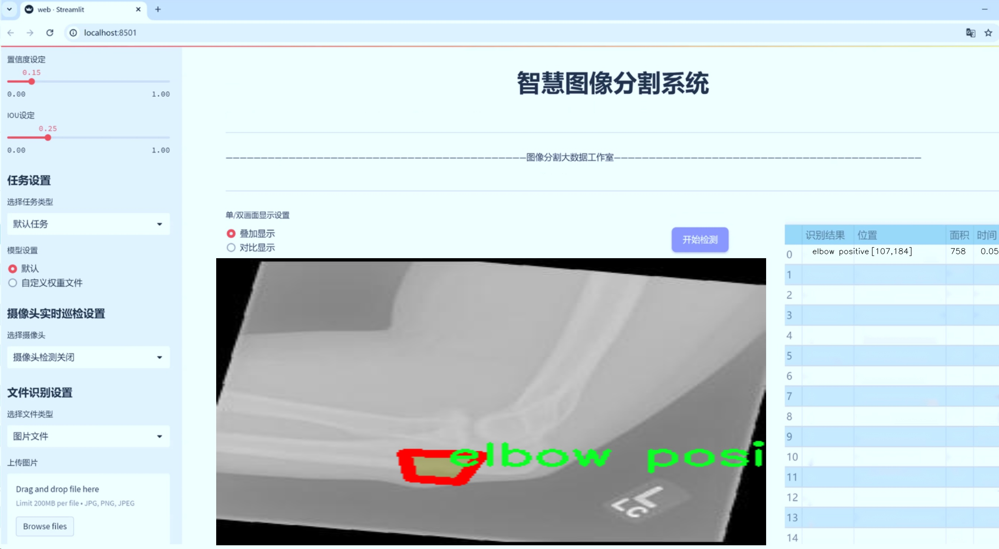
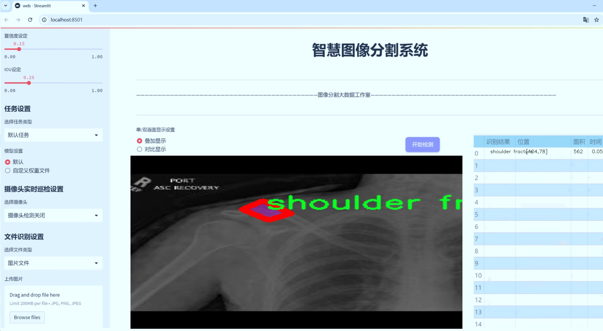
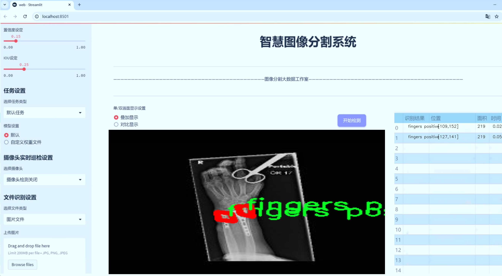
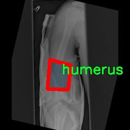
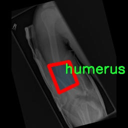
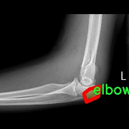
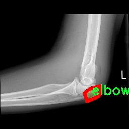
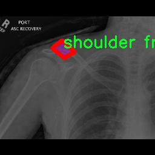

# 骨折图像分割系统源码＆数据集分享
 [yolov8-seg-efficientViT＆yolov8-seg-C2f-CloAtt等50+全套改进创新点发刊_一键训练教程_Web前端展示]

### 1.研究背景与意义

项目参考[ILSVRC ImageNet Large Scale Visual Recognition Challenge](https://gitee.com/YOLOv8_YOLOv11_Segmentation_Studio/projects)

项目来源[AAAI Global Al lnnovation Contest](https://kdocs.cn/l/cszuIiCKVNis)

研究背景与意义

骨折作为一种常见的外伤性疾病，严重影响患者的生活质量和身体功能。随着人口老龄化和运动参与度的增加，骨折的发生率逐年上升，尤其是在老年人和运动员中。传统的骨折诊断主要依赖于医生的临床经验和X光影像的解读，然而，X光图像的二维特性和医生的主观判断往往导致误诊和漏诊。因此，开发一种高效、准确的骨折图像分割系统，能够为临床医生提供更为可靠的辅助诊断工具，具有重要的现实意义。

近年来，深度学习技术的迅猛发展为医学影像分析带来了新的机遇。YOLO（You Only Look Once）系列模型因其优越的实时性和准确性，已成为目标检测和分割领域的热门选择。YOLOv8作为该系列的最新版本，具备更强的特征提取能力和更高的处理速度，适合用于复杂的医学影像分析任务。通过对YOLOv8进行改进，结合骨折图像的特征，可以有效提升骨折分割的精度和效率，为临床提供更为精准的影像信息。

本研究将基于改进的YOLOv8模型，构建一个针对骨折图像的分割系统。所使用的数据集包含2100幅骨折相关图像，涵盖了七个不同的类别，包括肘部骨折、手指骨折、前臂骨折、肱骨骨折、肩部骨折和腕部骨折等。这些类别的多样性为模型的训练提供了丰富的样本，有助于提升模型的泛化能力和鲁棒性。通过对这些图像进行实例分割，系统能够精确地识别和分割出不同类型的骨折区域，为医生提供更为直观的影像信息。

在临床应用中，准确的骨折分割不仅可以帮助医生更快地做出诊断，还能为后续的治疗方案制定提供重要依据。通过对骨折类型和位置的准确识别，医生可以更好地评估骨折的严重程度，从而制定个性化的治疗方案。此外，基于分割结果的三维重建技术也可以为手术规划和术后评估提供支持，进一步提升治疗效果。

综上所述，基于改进YOLOv8的骨折图像分割系统的研究，不仅具有重要的学术价值，还有助于推动骨折诊断技术的进步，提升临床医疗水平。通过深入探讨和解决当前骨折影像分析中的挑战，本研究将为骨折的早期诊断和治疗提供新的思路和方法，最终造福广大患者。

### 2.图片演示







##### 注意：由于此博客编辑较早，上面“2.图片演示”和“3.视频演示”展示的系统图片或者视频可能为老版本，新版本在老版本的基础上升级如下：（实际效果以升级的新版本为准）

  （1）适配了YOLOV8的“目标检测”模型和“实例分割”模型，通过加载相应的权重（.pt）文件即可自适应加载模型。

  （2）支持“图片识别”、“视频识别”、“摄像头实时识别”三种识别模式。

  （3）支持“图片识别”、“视频识别”、“摄像头实时识别”三种识别结果保存导出，解决手动导出（容易卡顿出现爆内存）存在的问题，识别完自动保存结果并导出到tempDir中。

  （4）支持Web前端系统中的标题、背景图等自定义修改，后面提供修改教程。

  另外本项目提供训练的数据集和训练教程,暂不提供权重文件（best.pt）,需要您按照教程进行训练后实现图片演示和Web前端界面演示的效果。

### 3.视频演示

[3.1 视频演示](https://www.bilibili.com/video/BV18VDdYuEhQ/)

### 4.数据集信息展示

##### 4.1 本项目数据集详细数据（类别数＆类别名）

nc: 7
names: ['elbow positive', 'fingers positive', 'forearm fracture', 'humerus', 'humerus fracture', 'shoulder fracture', 'wrist positive']


##### 4.2 本项目数据集信息介绍

数据集信息展示

在现代医学影像分析中，骨折的准确识别与分割是临床诊断和治疗方案制定的重要环节。为此，我们构建了一个名为“Bone fractures”的数据集，旨在为改进YOLOv8-seg的骨折图像分割系统提供高质量的训练数据。该数据集包含了七个不同类别的骨折图像，涵盖了多种常见的骨折类型，具体类别包括：肘部正向骨折（elbow positive）、手指正向骨折（fingers positive）、前臂骨折（forearm fracture）、肱骨（humerus）、肱骨骨折（humerus fracture）、肩部骨折（shoulder fracture）以及腕部正向骨折（wrist positive）。这些类别的选择基于临床实践中最常见的骨折类型，旨在为模型的训练提供全面而多样化的样本。

数据集中的每一类骨折图像均经过精心标注，确保了数据的准确性和可靠性。图像来源于真实的医学影像，涵盖了不同患者、不同年龄段以及不同性别的样本，力求反映出骨折发生的多样性。每一张图像不仅展示了骨折的具体部位，还包含了不同的视角和拍摄条件，以增强模型的泛化能力。这种多样性使得模型在实际应用中能够更好地适应不同的临床场景，提高了骨折检测和分割的准确性。

在数据集的构建过程中，我们特别关注了图像的质量和标注的一致性。所有图像均经过专业放射科医师的审核，确保标注的准确性。此外，为了提高模型的鲁棒性，我们还对图像进行了多种预处理操作，包括图像增强、噪声去除和归一化处理。这些步骤不仅提升了图像的可用性，还为模型的训练提供了更为清晰的特征信息，从而提高了分割的精度。

为了确保数据集的可用性和易于访问，我们将数据集分为训练集、验证集和测试集。训练集用于模型的训练，验证集用于调整模型参数，而测试集则用于评估模型的最终性能。这样的划分方式能够有效避免过拟合现象，并确保模型在未见数据上的表现。

此外，数据集还配备了详细的文档，说明了数据的来源、标注方法以及使用注意事项。这些信息不仅为研究人员提供了必要的背景知识，也为后续的研究和开发提供了参考依据。我们希望通过这个数据集的发布，能够推动骨折图像分割领域的研究进展，并为临床应用提供更为精准的技术支持。

总之，“Bone fractures”数据集的构建是一个多方面的综合性工作，旨在为改进YOLOv8-seg的骨折图像分割系统提供强有力的支持。通过丰富的类别、多样的样本以及高质量的标注，我们期待该数据集能够为相关研究者和开发者提供有价值的资源，推动骨折检测技术的进步，为患者的健康管理提供更为有效的解决方案。











### 5.全套项目环境部署视频教程（零基础手把手教学）

[5.1 环境部署教程链接（零基础手把手教学）](https://www.bilibili.com/video/BV1jG4Ve4E9t/?vd_source=bc9aec86d164b67a7004b996143742dc)


[5.2 安装Python虚拟环境创建和依赖库安装视频教程链接（零基础手把手教学）](https://www.bilibili.com/video/BV1nA4VeYEze/?vd_source=bc9aec86d164b67a7004b996143742dc)

### 6.手把手YOLOV8-seg训练视频教程（零基础小白有手就能学会）

[6.1 手把手YOLOV8-seg训练视频教程（零基础小白有手就能学会）](https://www.bilibili.com/video/BV1cA4VeYETe/?vd_source=bc9aec86d164b67a7004b996143742dc)


按照上面的训练视频教程链接加载项目提供的数据集，运行train.py即可开始训练



     Epoch   gpu_mem       box       obj       cls    labels  img_size
     1/200     0G   0.01576   0.01955  0.007536        22      1280: 100%|██████████| 849/849 [14:42<00:00,  1.04s/it]
               Class     Images     Labels          P          R     mAP@.5 mAP@.5:.95: 100%|██████████| 213/213 [01:14<00:00,  2.87it/s]
                 all       3395      17314      0.994      0.957      0.0957      0.0843

     Epoch   gpu_mem       box       obj       cls    labels  img_size
     2/200     0G   0.01578   0.01923  0.007006        22      1280: 100%|██████████| 849/849 [14:44<00:00,  1.04s/it]
               Class     Images     Labels          P          R     mAP@.5 mAP@.5:.95: 100%|██████████| 213/213 [01:12<00:00,  2.95it/s]
                 all       3395      17314      0.996      0.956      0.0957      0.0845

     Epoch   gpu_mem       box       obj       cls    labels  img_size
     3/200     0G   0.01561    0.0191  0.006895        27      1280: 100%|██████████| 849/849 [10:56<00:00,  1.29it/s]
               Class     Images     Labels          P          R     mAP@.5 mAP@.5:.95: 100%|███████   | 187/213 [00:52<00:00,  4.04it/s]
                 all       3395      17314      0.996      0.957      0.0957      0.0845


### 7.50+种全套YOLOV8-seg创新点代码加载调参视频教程（一键加载写好的改进模型的配置文件）

[7.1 50+种全套YOLOV8-seg创新点代码加载调参视频教程（一键加载写好的改进模型的配置文件）](https://www.bilibili.com/video/BV1Hw4VePEXv/?vd_source=bc9aec86d164b67a7004b996143742dc)

### 8.YOLOV8-seg图像分割算法原理

原始YOLOv8-seg算法原理

YOLOv8-seg算法是由Ultralytics公司于2023年推出的最新目标检测和分割模型，它在YOLO系列的基础上进行了多项创新和改进，尤其是在特征提取和处理效率方面。YOLOv8-seg不仅能够高效地进行目标检测，还能够实现精确的实例分割，因而在计算机视觉领域中具有广泛的应用潜力。该算法的核心结构包括输入层、主干网络、颈部网络和头部网络等几个主要组件，每个部分都经过精心设计，以确保模型在处理复杂场景时的高效性和准确性。

首先，YOLOv8-seg的输入层负责接收图像数据，并对其进行预处理，包括缩放和归一化，以满足模型的输入要求。此过程确保了输入图像的尺寸一致性，从而使得后续的特征提取和处理能够顺利进行。接下来，主干网络采用了CSP（Cross Stage Partial）结构，进一步提升了特征提取的效率。CSP结构通过将特征提取过程分为两个部分，分别进行卷积和连接，有效地增强了模型的表达能力。在YOLOv8-seg中，C2f模块被引入以替代YOLOv5中的C3模块，这一新模块借鉴了YOLOv7中的E-ELAN结构，增加了更多的残差连接，显著改善了梯度流动，从而提升了模型的检测性能。

在主干网络的末尾，YOLOv8-seg采用了SPPF（Spatial Pyramid Pooling Fast）模块，这一模块通过三个最大池化层的组合，增强了模型对多尺度特征的处理能力。SPPF模块的引入不仅提高了特征的抽象能力，还有效地加快了模型的计算速度，使得YOLOv8-seg在实时应用中表现出色。主干网络提取到的特征随后被传递到颈部网络，颈部网络采用了PAN-FPN（Path Aggregation Network - Feature Pyramid Network）结构，旨在融合不同尺度的特征图信息。通过这一结构，YOLOv8-seg能够有效地捕捉到目标的多层次信息，从而提高检测和分割的精度。

在头部网络中，YOLOv8-seg采用了解耦合的检测头结构，这一设计使得分类和回归任务可以并行进行，进一步提升了模型的处理效率。与传统的Anchor-Based方法不同，YOLOv8-seg采用了Anchor-Free的检测方式，这一创新减少了模型对锚框的依赖，使得目标检测更加灵活和高效。解耦合头结构的引入，使得模型在进行目标分类和位置回归时能够独立优化，从而提升了整体性能。

在损失函数的设计上，YOLOv8-seg使用了BCELoss作为分类损失，DFLLoss和CIoULoss作为回归损失。这一组合的损失函数设计旨在平衡分类和回归任务的优化，确保模型在训练过程中能够有效地学习到目标的特征信息。此外，YOLOv8-seg在训练过程中采用了动态Task-Aligned Assigner样本分配策略，这一策略能够根据任务的复杂性动态调整样本的分配，提高了训练的效率和效果。

YOLOv8-seg的设计理念不仅体现在其结构的创新上，还在于其对实际应用场景的深刻理解。通过引入多种数据增强技术，YOLOv8-seg能够在不同的环境和条件下保持高效的性能。例如，在训练的最后10个epoch中，模型关闭了马赛克增强，以避免对特征学习的干扰。这一细致的设计使得YOLOv8-seg在面对复杂背景和多样化目标时，依然能够保持良好的检测和分割效果。

总的来说，YOLOv8-seg算法在YOLO系列的基础上进行了多项创新，特别是在特征提取、网络结构和损失函数设计等方面的改进，使得该算法在目标检测和实例分割任务中展现出卓越的性能。其高效的计算能力和优越的检测精度，使得YOLOv8-seg在计算机视觉领域中具有广泛的应用前景，能够满足各种实际需求，从智能监控到自动驾驶等多个领域，YOLOv8-seg都展现出了其强大的适应性和实用性。


### 9.系统功能展示（检测对象为举例，实际内容以本项目数据集为准）

图9.1.系统支持检测结果表格显示

  图9.2.系统支持置信度和IOU阈值手动调节

  图9.3.系统支持自定义加载权重文件best.pt(需要你通过步骤5中训练获得)

  图9.4.系统支持摄像头实时识别

  图9.5.系统支持图片识别

  图9.6.系统支持视频识别

  图9.7.系统支持识别结果文件自动保存

  图9.8.系统支持Excel导出检测结果数据


### 10.50+种全套YOLOV8-seg创新点原理讲解（非科班也可以轻松写刊发刊，V11版本正在科研待更新）

#### 10.1 由于篇幅限制，每个创新点的具体原理讲解就不一一展开，具体见下列网址中的创新点对应子项目的技术原理博客网址【Blog】：


[10.1 50+种全套YOLOV8-seg创新点原理讲解链接](https://gitee.com/qunmasj/good)

#### 10.2 部分改进模块原理讲解(完整的改进原理见上图和技术博客链接)【如果此小节的图加载失败可以通过CSDN或者Github搜索该博客的标题访问原始博客，原始博客图片显示正常】
### 可变性卷积DCN简介
卷积神经网络由于其构建模块中固定的几何结构，本质上受限于模型几何变换。为了提高卷积神经网络的转换建模能力，《Deformable Convolutional Networks》作者提出了两个模块：可变形卷积（deformable convolution）和可变形RoI池（deformable RoI pooling）。这两个模块均基于用额外的偏移来增加模块中的空间采样位置以及从目标任务中学习偏移的思想，而不需要额外的监督。

第一次证明了在深度神经网络中学习密集空间变换（dense spatial transformation）对于复杂的视觉任务是有效的

视觉识别中的一个关键挑战是如何适应对象比例、姿态、视点和零件变形中的几何变化或模型几何变换。一般有两种方法实现：
1）建立具有足够期望变化的训练数据集。这通常通过增加现有的数据样本来实现，例如通过仿射变换。但是训练成本昂贵而且模型参数庞大。
2）使用变换不变（transformation-invariant）的特征和算法。比如比较有名的SIFT(尺度不变特征变换)便是这一类的代表算法。

但以上的方法有两个缺点：
1）几何变换被假定为固定的和已知的，这些先验知识被用来扩充数据，设计特征和算法。为此，这个假设阻止了对具有未知几何变换的新任务的推广，从而导致这些几何变换可能没有被正确建模。
2）对于不变特征和算法进行手动设计，对于过于复杂的变换可能是困难的或不可行的。

卷积神经网络本质上局限于模拟大型未知转换。局限性源于CNN模块的固定几何结构：卷积单元在固定位置对输入特征图进行采样；池化层以固定比率降低特征矩阵分辨率；RoI（感兴趣区域）池化层将RoI分成固定的空间箱（spatial bins）等。缺乏处理几何变换的内部机制。

这种内部机制的缺乏会导致一些问题，举个例子。同一个CNN层中所有激活单元的感受野大小是相同的，但是这是不可取的。因为不同的位置可能对应于具有不同尺度或变形的对象，所以尺度或感受野大小的自适应确定对于具有精细定位的视觉识别是渴望的。

对于这些问题，作者提出了两个模块提高CNNs对几何变换建模的能力。


deformable convolution（可变形卷积）
将2D偏移量添加到标准卷积中的常规网格采样位置，使得采样网格能够自由变形。通过额外的卷积层，从前面的特征映射中学习偏移。因此，变形采用局部、密集和自适应的方式取决于输入特征。


deformable RoI pooling（可变形RoI池化）
为先前RoI池化的常规库（bin）分区中的每个库位置（bin partition）增加了一个偏移量。类似地，偏移是从前面的特征图和感兴趣区域中学习的，从而能够对具有不同形状的对象进行自适应部件定位（adaptive part localization）。

#### Deformable Convolutional Networks
Deformable Convolution
2D卷积由两个步骤组成：
1）在输入特征图x xx上使用规则网格R RR进行采样。
2）把这些采样点乘不同权重w ww后相加。

网格R定义感受野大小和扩张程度，比如内核大小为3x3，扩张程度为1的网格R可以表示为：
R = { ( − 1 , − 1 ) , ( − 1 , 0 ) , … , ( 0 , 1 ) , ( 1 , 1 ) } R = \{(-1,-1),(-1,0),\dots,(0,1),(1,1)\}
R={(−1,−1),(−1,0),…,(0,1),(1,1)}

​
 一般为小数，使用双线性插值进行处理。（把小数坐标分解到相邻的四个整数坐标点来计算结果）


具体操作如图所示：


首先对输入特征层进行一个普通的3x3卷积处理得到偏移域（offset field）。偏移域特征图具有与输入特征图相同的空间分辨率，channels维度2N对应于N个2D（xy两个方向）偏移。其中的N是原输入特征图上所具有的N个channels，也就是输入输出channels保持不变，这里xy两个channels分别对输出特征图上的一个channels进行偏移。确定采样点后就通过与相对应的权重w点乘相加得到输出特征图上该点最终值。

前面也提到过，由于这里xy两个方向所训练出来的偏移量一般来说是一个小数，那么为了得到这个点所对应的数值，会采用双线性插值的方法，从最近的四个邻近坐标点中计算得到该偏移点的数值，公式如下：


具体推理过程见：双线性插值原理

#### Deformable RoI Poolingb
所有基于区域提议（RPN）的对象检测方法都使用RoI池话处理，将任意大小的输入矩形区域转换为固定大小的特征图。


 一般为小数，需要使用双线性插值进行处理。


具体操作如图所示：


当时看这个部分的时候觉得有些突兀，明明RoI池化会将特征层转化为固定尺寸的区域。其实，我个人觉得，这个部分与上述的可变性卷积操作是类似的。这里同样是使用了一个普通的RoI池化操作，进行一些列处理后得到了一个偏移域特征图，然后重新作用于原来的w × H w \times Hw×H的RoI。只不过这里不再是规律的逐行逐列对每个格子进行池化，而是对于格子进行偏移后再池化处理。

#### Postion﹣Sensitive RoI Pooling
除此之外，论文还提出一种PS RoI池化（Postion﹣Sensitive RoI Pooling）。不同于上述可变形RoI池化中的全连接过程，这里使用全卷积替换。

具体操作如图所示：


首先，对于原来的特征图来说，原本是将输入特征图上的RoI区域分成k × k k\times kk×k个bin。而在这里，则是将输入特征图进行卷积操作，分别得到一个channels为k 2 ( C + 1 ) k^{2}(C+1)k (C+1)的得分图（score maps）和一个channels为2 k 2 ( C + 1 ) 2k{2}(C+1)2k 2 (C+1)的偏移域（offset fields），这两个特征矩阵的宽高是与输入特征矩阵相同的。其中，得分图的channels中，k × k k \times kk×k分别表示的是每一个网格，C CC表示的检测对象的类别数目，1表示背景。而在偏移域中的2表示xy两个方向的偏移。
也就是说，在PS RoI池化中，对于RoI的每一个网格都独自占一个通道形成一层得分图，然后其对于的偏移量占两个通道。offset fields得到的偏移是归一化后的偏移，需要通过和deformable RoI pooling中一样的变换方式得到∆ p i j ∆p_{ij}∆p ij，然后对每层得分图进行偏移池化处理。最后处理完的结果就对应着最后输出的一个网格。所以其包含了位置信息。

原文论述为：


#### Understanding Deformable ConvNets
当可变形卷积叠加时，复合变形的效果是深远的。如图所示：


ps：a是标准卷积的固定感受野，b是可变形卷积的适应性感受野。

感受野和标准卷积中的采样位置在整个顶部特征图上是固定的(左)。在可变形卷积中，它们根据对象的比例和形状进行自适应调整(右)。


### 11.项目核心源码讲解（再也不用担心看不懂代码逻辑）

#### 11.1 ultralytics\data\dataset.py

以下是对代码的核心部分进行提炼和详细注释的结果：

```python
# 导入必要的库
import contextlib
from itertools import repeat
from multiprocessing.pool import ThreadPool
from pathlib import Path
import cv2
import numpy as np
import torch
import torchvision
from ultralytics.utils import LOCAL_RANK, NUM_THREADS, TQDM, colorstr, is_dir_writeable
from .base import BaseDataset
from .utils import HELP_URL, LOGGER, get_hash, img2label_paths, verify_image, verify_image_label

# 数据集缓存版本
DATASET_CACHE_VERSION = '1.0.3'

class YOLODataset(BaseDataset):
    """
    YOLO格式的数据集类，用于加载目标检测和/或分割标签。
    """

    def __init__(self, *args, data=None, use_segments=False, use_keypoints=False, **kwargs):
        """初始化YOLODataset，配置分割和关键点的使用选项。"""
        self.use_segments = use_segments  # 是否使用分割
        self.use_keypoints = use_keypoints  # 是否使用关键点
        self.data = data  # 数据集配置
        assert not (self.use_segments and self.use_keypoints), '不能同时使用分割和关键点。'
        super().__init__(*args, **kwargs)

    def cache_labels(self, path=Path('./labels.cache')):
        """
        缓存数据集标签，检查图像并读取形状。
        """
        x = {'labels': []}  # 初始化标签字典
        nm, nf, ne, nc, msgs = 0, 0, 0, 0, []  # 统计信息
        total = len(self.im_files)  # 总图像数量
        nkpt, ndim = self.data.get('kpt_shape', (0, 0))  # 获取关键点形状

        # 验证关键点形状
        if self.use_keypoints and (nkpt <= 0 or ndim not in (2, 3)):
            raise ValueError("'kpt_shape'在data.yaml中缺失或不正确。")

        # 使用线程池并行处理图像验证
        with ThreadPool(NUM_THREADS) as pool:
            results = pool.imap(func=verify_image_label,
                                iterable=zip(self.im_files, self.label_files, repeat(self.prefix),
                                             repeat(self.use_keypoints), repeat(len(self.data['names'])), repeat(nkpt),
                                             repeat(ndim)))
            pbar = TQDM(results, desc='扫描中...', total=total)  # 进度条
            for im_file, lb, shape, segments, keypoint, nm_f, nf_f, ne_f, nc_f, msg in pbar:
                nm += nm_f
                nf += nf_f
                ne += ne_f
                nc += nc_f
                if im_file:
                    x['labels'].append(
                        dict(
                            im_file=im_file,
                            shape=shape,
                            cls=lb[:, 0:1],  # 类别
                            bboxes=lb[:, 1:],  # 边界框
                            segments=segments,
                            keypoints=keypoint,
                            normalized=True,
                            bbox_format='xywh'))  # 边界框格式
                if msg:
                    msgs.append(msg)
                pbar.desc = f'扫描中... {nf}图像, {nm + ne}背景, {nc}损坏'

        if msgs:
            LOGGER.info('\n'.join(msgs))  # 记录警告信息
        if nf == 0:
            LOGGER.warning(f'警告 ⚠️ 在{path}中未找到标签。')
        x['hash'] = get_hash(self.label_files + self.im_files)  # 计算哈希值
        x['results'] = nf, nm, ne, nc, len(self.im_files)  # 统计结果
        x['msgs'] = msgs  # 警告信息
        save_dataset_cache_file(self.prefix, path, x)  # 保存缓存文件
        return x

    def get_labels(self):
        """返回YOLO训练的标签字典。"""
        self.label_files = img2label_paths(self.im_files)  # 获取标签文件路径
        cache_path = Path(self.label_files[0]).parent.with_suffix('.cache')  # 缓存文件路径
        try:
            cache, exists = load_dataset_cache_file(cache_path), True  # 尝试加载缓存文件
            assert cache['version'] == DATASET_CACHE_VERSION  # 验证版本
            assert cache['hash'] == get_hash(self.label_files + self.im_files)  # 验证哈希
        except (FileNotFoundError, AssertionError, AttributeError):
            cache, exists = self.cache_labels(cache_path), False  # 运行缓存操作

        # 显示缓存信息
        nf, nm, ne, nc, n = cache.pop('results')  # 获取统计结果
        if exists and LOCAL_RANK in (-1, 0):
            d = f'扫描 {cache_path}... {nf}图像, {nm + ne}背景, {nc}损坏'
            TQDM(None, desc=self.prefix + d, total=n, initial=n)  # 显示结果
            if cache['msgs']:
                LOGGER.info('\n'.join(cache['msgs']))  # 显示警告

        # 读取缓存
        [cache.pop(k) for k in ('hash', 'version', 'msgs')]  # 移除不必要的项
        labels = cache['labels']  # 获取标签
        if not labels:
            LOGGER.warning(f'警告 ⚠️ 在{cache_path}中未找到图像，训练可能无法正常工作。')
        self.im_files = [lb['im_file'] for lb in labels]  # 更新图像文件列表

        # 检查数据集是否全为边界框或全为分割
        lengths = ((len(lb['cls']), len(lb['bboxes']), len(lb['segments'])) for lb in labels)
        len_cls, len_boxes, len_segments = (sum(x) for x in zip(*lengths))
        if len_segments and len_boxes != len_segments:
            LOGGER.warning(
                f'警告 ⚠️ 边界框和分割计数应相等，但得到了len(segments) = {len_segments}, '
                f'len(boxes) = {len_boxes}。将只使用边界框，所有分割将被移除。')
            for lb in labels:
                lb['segments'] = []  # 移除分割
        if len_cls == 0:
            LOGGER.warning(f'警告 ⚠️ 在{cache_path}中未找到标签，训练可能无法正常工作。')
        return labels  # 返回标签

    def build_transforms(self, hyp=None):
        """构建并附加变换到列表中。"""
        if self.augment:
            transforms = v8_transforms(self, self.imgsz, hyp)  # 使用增强变换
        else:
            transforms = Compose([LetterBox(new_shape=(self.imgsz, self.imgsz), scaleup=False)])  # 使用LetterBox变换
        transforms.append(
            Format(bbox_format='xywh',
                   normalize=True,
                   return_mask=self.use_segments,
                   return_keypoint=self.use_keypoints,
                   batch_idx=True))
        return transforms  # 返回变换列表

    @staticmethod
    def collate_fn(batch):
        """将数据样本合并为批次。"""
        new_batch = {}
        keys = batch[0].keys()  # 获取键
        values = list(zip(*[list(b.values()) for b in batch]))  # 合并值
        for i, k in enumerate(keys):
            value = values[i]
            if k == 'img':
                value = torch.stack(value, 0)  # 堆叠图像
            if k in ['masks', 'keypoints', 'bboxes', 'cls']:
                value = torch.cat(value, 0)  # 连接其他数据
            new_batch[k] = value
        new_batch['batch_idx'] = list(new_batch['batch_idx'])
        for i in range(len(new_batch['batch_idx'])):
            new_batch['batch_idx'][i] += i  # 添加目标图像索引
        new_batch['batch_idx'] = torch.cat(new_batch['batch_idx'], 0)  # 合并索引
        return new_batch  # 返回合并后的批次

# 其他类和函数的定义省略
```

以上代码保留了YOLO数据集的核心功能，并对关键部分进行了详细的中文注释，帮助理解每个函数和类的作用。

这个文件是Ultralytics YOLO（You Only Look Once）项目中的数据集处理模块，主要用于加载和处理目标检测和分类任务的数据集。文件中定义了多个类和函数，主要包括YOLODataset、ClassificationDataset和SemanticDataset。

首先，YOLODataset类继承自BaseDataset，负责加载YOLO格式的目标检测和分割标签。它的构造函数接受多个参数，包括数据集的配置、是否使用分割掩码和关键点等。构造函数中有一个断言，确保不能同时使用分割和关键点。

cache_labels方法用于缓存数据集标签，检查图像并读取形状。它使用多线程池来并行处理图像和标签，利用verify_image_label函数验证每个图像和标签的有效性。结果会被缓存到指定路径，以便后续使用。get_labels方法则用于获取YOLO训练所需的标签字典，它会尝试加载缓存文件，如果加载失败，则调用cache_labels方法进行缓存操作。

build_transforms方法用于构建数据增强的转换操作，支持不同的增强策略，如马赛克、混合等。close_mosaic方法则是将马赛克等增强选项设置为0，构建转换操作。update_labels_info方法用于自定义标签格式，支持将边界框、分割和关键点信息整合到一个实例中。

collate_fn静态方法用于将数据样本整理成批次，方便后续的训练过程。

接下来是ClassificationDataset类，它是YOLO分类数据集的实现，继承自torchvision.datasets.ImageFolder。它的构造函数接受数据集路径、参数设置、增强和缓存选项。__getitem__方法用于返回给定索引的样本和目标，支持从内存或磁盘加载图像，并应用相应的转换。verify_images方法用于验证数据集中所有图像的有效性，并生成缓存文件。

load_dataset_cache_file和save_dataset_cache_file函数用于加载和保存数据集的缓存文件，确保数据处理的高效性。

最后，SemanticDataset类是一个占位符类，旨在处理语义分割任务的数据集，目前尚未实现具体的方法和属性。

整体来看，这个文件的主要功能是提供一个灵活的数据集处理框架，支持目标检测、分类和未来的语义分割任务，通过缓存机制和多线程处理提高数据加载的效率。

#### 11.2 ultralytics\utils\plotting.py

以下是经过简化和注释的核心代码部分，主要集中在 `Colors` 和 `Annotator` 类的实现上。

```python
import numpy as np
from PIL import Image, ImageDraw, ImageFont

class Colors:
    """
    颜色类，用于处理颜色调色板，包括将十六进制颜色代码转换为RGB值。
    """

    def __init__(self):
        """初始化颜色调色板，使用预定义的十六进制颜色值。"""
        hexs = ('FF3838', 'FF9D97', 'FF701F', 'FFB21D', 'CFD231', 
                '48F90A', '92CC17', '3DDB86', '1A9334', '00D4BB',
                '2C99A8', '00C2FF', '344593', '6473FF', '0018EC', 
                '8438FF', '520085', 'CB38FF', 'FF95C8', 'FF37C7')
        # 将十六进制颜色转换为RGB格式
        self.palette = [self.hex2rgb(f'#{c}') for c in hexs]
        self.n = len(self.palette)  # 颜色数量

    def __call__(self, i, bgr=False):
        """根据索引返回颜色，支持BGR格式。"""
        c = self.palette[int(i) % self.n]  # 获取颜色
        return (c[2], c[1], c[0]) if bgr else c  # 如果需要BGR格式则返回BGR

    @staticmethod
    def hex2rgb(h):
        """将十六进制颜色代码转换为RGB值。"""
        return tuple(int(h[1 + i:1 + i + 2], 16) for i in (0, 2, 4))


class Annotator:
    """
    注释类，用于在图像上绘制边框、文本和关键点。
    """

    def __init__(self, im, line_width=None, font_size=None, font='Arial.ttf', pil=False):
        """初始化Annotator类，设置图像和绘制参数。"""
        self.im = im if isinstance(im, Image.Image) else Image.fromarray(im)  # 转换为PIL图像
        self.draw = ImageDraw.Draw(self.im)  # 创建绘图对象
        self.lw = line_width or 2  # 线宽，默认为2
        self.font = ImageFont.truetype(font, font_size or 12)  # 设置字体和大小

    def box_label(self, box, label='', color=(128, 128, 128), txt_color=(255, 255, 255)):
        """在图像上添加边框和标签。"""
        self.draw.rectangle(box, width=self.lw, outline=color)  # 绘制边框
        if label:
            w, h = self.font.getsize(label)  # 获取文本的宽度和高度
            self.draw.rectangle((box[0], box[1] - h, box[0] + w + 1, box[1] + 1), fill=color)  # 绘制标签背景
            self.draw.text((box[0], box[1] - h), label, fill=txt_color, font=self.font)  # 绘制标签文本

    def result(self):
        """返回注释后的图像。"""
        return np.asarray(self.im)  # 将PIL图像转换为numpy数组
```

### 代码说明
1. **Colors 类**：
   - 该类用于管理颜色调色板，提供将十六进制颜色代码转换为RGB格式的功能。
   - 在初始化时，定义了一组十六进制颜色，并将其转换为RGB格式存储在 `self.palette` 中。
   - `__call__` 方法允许通过索引获取颜色，并支持返回BGR格式。

2. **Annotator 类**：
   - 该类用于在图像上绘制边框、文本和关键点。
   - 在初始化时，接受图像、线宽、字体大小和字体类型，并创建一个绘图对象。
   - `box_label` 方法用于在图像上绘制矩形框和标签，首先绘制框，然后在框上方绘制标签文本。
   - `result` 方法返回注释后的图像，以便后续处理或保存。

这个程序文件 `ultralytics/utils/plotting.py` 是用于图像处理和可视化的工具，主要与 Ultralytics YOLO（一个流行的目标检测模型）相关。文件中包含多个类和函数，提供了绘制图像、标注、绘制结果和处理颜色等功能。

首先，文件引入了一些必要的库，包括 `cv2`（OpenCV）、`matplotlib`、`numpy`、`torch` 和 `PIL`。这些库为图像处理、绘图和张量操作提供了支持。

文件中定义了一个 `Colors` 类，用于管理和转换颜色。该类初始化了一组颜色的调色板，并提供了将十六进制颜色代码转换为 RGB 值的方法。这个类的实例可以在绘制图像时用来选择颜色。

接下来是 `Annotator` 类，它用于在图像上进行标注。这个类可以处理 PIL 或 OpenCV 图像，并支持绘制矩形框、文本、关键点和掩膜等。构造函数中会根据输入图像的类型和标注需求设置相应的参数，如线宽、字体等。该类提供了多种方法来绘制边框、文本、关键点和掩膜等，适用于目标检测和姿态估计等任务。

文件还包含多个函数，例如 `plot_labels`、`save_one_box`、`plot_images` 和 `plot_results`，这些函数用于绘制标签、保存图像裁剪、绘制图像网格以及绘制训练结果等。每个函数都有详细的参数说明和功能描述，便于用户理解和使用。

例如，`plot_labels` 函数用于绘制训练标签，包括类直方图和框统计信息。它使用 `seaborn` 和 `matplotlib` 来生成可视化图表，并将结果保存为图像文件。`save_one_box` 函数则用于根据给定的边界框从图像中裁剪出一个区域，并可选择性地保存该裁剪图像。

此外，`plot_images` 函数用于绘制图像网格，并在每个图像上添加标签和边框。它支持绘制目标检测的边界框、关键点和掩膜等信息。最后，`plot_results` 函数可以从 CSV 文件中读取训练结果并生成相应的图表，便于分析模型的性能。

总的来说，这个文件提供了一系列强大的工具，用于处理图像、可视化模型的输出和分析训练结果，适合用于目标检测和相关计算机视觉任务。

#### 11.3 demo_test_video.py

以下是经过简化和注释的核心代码部分：

```python
import cv2
import numpy as np
from PIL import ImageFont, ImageDraw, Image
from hashlib import md5
from model import Web_Detector
from chinese_name_list import Label_list

def generate_color_based_on_name(name):
    # 使用MD5哈希函数生成稳定的颜色
    hash_object = md5(name.encode())
    hex_color = hash_object.hexdigest()[:6]  # 取前6位16进制数
    r, g, b = int(hex_color[0:2], 16), int(hex_color[2:4], 16), int(hex_color[4:6], 16)
    return (b, g, r)  # OpenCV 使用BGR格式

def draw_with_chinese(image, text, position, font_size=20, color=(255, 0, 0)):
    # 使用PIL库在图像上绘制中文文本
    image_pil = Image.fromarray(cv2.cvtColor(image, cv2.COLOR_BGR2RGB))
    draw = ImageDraw.Draw(image_pil)
    font = ImageFont.truetype("simsun.ttc", font_size, encoding="unic")  # 加载中文字体
    draw.text(position, text, font=font, fill=color)  # 绘制文本
    return cv2.cvtColor(np.array(image_pil), cv2.COLOR_RGB2BGR)  # 转回OpenCV格式

def draw_detections(image, info):
    # 绘制检测结果，包括边框、类别名称等
    name, bbox = info['class_name'], info['bbox']  # 提取类别名称和边界框
    x1, y1, x2, y2 = bbox  # 解包边界框坐标
    cv2.rectangle(image, (x1, y1), (x2, y2), color=(0, 0, 255), thickness=3)  # 绘制边界框
    image = draw_with_chinese(image, name, (x1, y1 - 10), font_size=20)  # 绘制类别名称
    return image

def process_frame(model, image):
    # 处理每一帧图像，进行目标检测
    pre_img = model.preprocess(image)  # 预处理图像
    pred = model.predict(pre_img)  # 进行预测
    det = pred[0]  # 获取检测结果

    if det is not None and len(det):
        det_info = model.postprocess(pred)  # 后处理获取检测信息
        for info in det_info:
            image = draw_detections(image, info)  # 绘制检测结果
    return image

if __name__ == "__main__":
    model = Web_Detector()  # 初始化检测模型
    model.load_model("./weights/yolov8s-seg.pt")  # 加载模型权重

    # 视频处理
    video_path = ''  # 输入视频路径
    cap = cv2.VideoCapture(video_path)  # 打开视频文件
    while cap.isOpened():
        ret, frame = cap.read()  # 逐帧读取视频
        if not ret:
            break
        processed_frame = process_frame(model, frame)  # 处理当前帧
        cv2.imshow('Processed Video', processed_frame)  # 显示处理后的视频
        if cv2.waitKey(1) & 0xFF == ord('q'):  # 按'q'键退出
            break
    cap.release()  # 释放视频捕获对象
    cv2.destroyAllWindows()  # 关闭所有OpenCV窗口
```

### 代码说明：
1. **生成颜色**：`generate_color_based_on_name` 函数通过哈希生成与名称相关的颜色，确保同一名称总是产生相同的颜色。
2. **绘制中文文本**：`draw_with_chinese` 函数使用PIL库在图像上绘制中文文本，支持中文字体。
3. **绘制检测结果**：`draw_detections` 函数在图像上绘制检测到的物体的边界框和类别名称。
4. **处理视频帧**：`process_frame` 函数对每一帧进行预处理、预测和后处理，最终绘制检测结果。
5. **主程序**：在主程序中，初始化模型并加载权重，逐帧读取视频并处理，最后显示处理后的视频。

这个程序文件 `demo_test_video.py` 是一个用于处理视频流的图像检测和标注工具，主要使用了 OpenCV 和深度学习模型来进行目标检测和分割。程序的核心功能包括从视频中读取帧、使用预训练模型进行目标检测、绘制检测结果以及显示处理后的视频。

首先，程序导入了一些必要的库，包括 `random`、`cv2`（OpenCV）、`numpy`、`PIL`（用于处理图像的库）、`hashlib`（用于生成哈希值）以及自定义的 `Web_Detector` 模型和 `Label_list`。这些库提供了图像处理、数学计算和深度学习模型的支持。

接下来，定义了几个辅助函数。`generate_color_based_on_name` 函数使用 MD5 哈希算法生成与输入名称相关的颜色，这样可以确保同一名称总是生成相同的颜色。`calculate_polygon_area` 函数计算给定点集（多边形）的面积。`draw_with_chinese` 函数则使用 PIL 库在图像上绘制中文文本，支持指定字体大小和颜色。

`adjust_parameter` 函数根据图像的大小调整参数，以确保绘制的元素在不同大小的图像中保持适当的比例。`draw_detections` 函数是核心功能之一，它根据检测到的信息（如类别名称、边界框、置信度、类别 ID 和掩膜）在图像上绘制检测结果。如果存在掩膜，它会绘制多边形并计算一些几何特征（如面积、周长和圆度），并在图像上显示这些信息。

`process_frame` 函数负责处理每一帧图像。它首先对图像进行预处理，然后使用模型进行预测，最后将检测到的对象绘制到图像上。

在 `__main__` 部分，程序初始化了类别名称列表和检测模型，并加载了预训练的权重文件。接着，程序打开视频文件并逐帧读取，调用 `process_frame` 函数处理每一帧，最后通过 OpenCV 显示处理后的结果。如果用户按下 'q' 键，程序将退出。

总体来说，这个程序实现了一个完整的视频目标检测流程，从读取视频、处理每一帧、进行目标检测到绘制检测结果并显示，适合用于实时监控或视频分析等应用场景。

#### 11.4 ultralytics\models\nas\model.py

以下是经过简化和注释的核心代码部分：

```python
from pathlib import Path
import torch
from ultralytics.engine.model import Model
from ultralytics.utils.torch_utils import model_info, smart_inference_mode
from .predict import NASPredictor
from .val import NASValidator

class NAS(Model):
    """
    YOLO NAS模型用于目标检测。

    该类提供YOLO-NAS模型的接口，并扩展了Ultralytics引擎中的`Model`类。
    旨在通过预训练或自定义训练的YOLO-NAS模型简化目标检测任务。
    """

    def __init__(self, model='yolo_nas_s.pt') -> None:
        """初始化NAS模型，使用提供的或默认的'yolo_nas_s.pt'模型。"""
        # 确保模型文件不是YAML配置文件
        assert Path(model).suffix not in ('.yaml', '.yml'), 'YOLO-NAS模型仅支持预训练模型。'
        super().__init__(model, task='detect')  # 调用父类构造函数

    @smart_inference_mode()
    def _load(self, weights: str, task: str):
        """加载现有的NAS模型权重，或如果未提供，则创建一个新的NAS模型并使用预训练权重。"""
        import super_gradients
        suffix = Path(weights).suffix  # 获取权重文件的后缀
        if suffix == '.pt':
            self.model = torch.load(weights)  # 加载.pt权重文件
        elif suffix == '':
            self.model = super_gradients.training.models.get(weights, pretrained_weights='coco')  # 获取预训练模型

        # 标准化模型属性
        self.model.fuse = lambda verbose=True: self.model  # 定义融合方法
        self.model.stride = torch.tensor([32])  # 设置步幅
        self.model.names = dict(enumerate(self.model._class_names))  # 设置类别名称
        self.model.is_fused = lambda: False  # 定义是否融合的方法
        self.model.yaml = {}  # 设置yaml为空字典
        self.model.pt_path = weights  # 设置权重路径
        self.model.task = 'detect'  # 设置任务类型为检测

    def info(self, detailed=False, verbose=True):
        """
        记录模型信息。

        参数:
            detailed (bool): 是否显示模型的详细信息。
            verbose (bool): 控制输出的详细程度。
        """
        return model_info(self.model, detailed=detailed, verbose=verbose, imgsz=640)  # 获取模型信息

    @property
    def task_map(self):
        """返回任务与相应预测器和验证器类的映射字典。"""
        return {'detect': {'predictor': NASPredictor, 'validator': NASValidator}}  # 返回检测任务的映射
```

### 代码注释说明：
1. **类定义**：`NAS`类是YOLO-NAS模型的接口，继承自`Model`类，主要用于目标检测。
2. **初始化方法**：`__init__`方法确保传入的模型文件是预训练模型，并调用父类的初始化方法。
3. **加载模型**：`_load`方法负责加载模型权重，可以是本地的`.pt`文件或从`super_gradients`获取的预训练模型。
4. **模型信息**：`info`方法用于记录和返回模型的相关信息，支持详细和简洁两种输出方式。
5. **任务映射**：`task_map`属性返回一个字典，映射检测任务到相应的预测器和验证器类。

这个程序文件定义了一个名为 `NAS` 的类，作为 YOLO-NAS 模型的接口，主要用于对象检测任务。该类继承自 Ultralytics 引擎中的 `Model` 类，旨在简化使用预训练或自定义训练的 YOLO-NAS 模型进行对象检测的过程。

在文件开头，提供了一个示例，展示了如何导入 `NAS` 类并使用它来加载模型和进行预测。用户可以通过指定模型名称（如 'yolo_nas_s'）来实例化 `NAS` 类，并使用 `predict` 方法对图像进行预测。

`NAS` 类的构造函数 `__init__` 接受一个参数 `model`，默认值为 'yolo_nas_s.pt'。构造函数中包含一个断言，确保传入的模型路径后缀不是 YAML 格式，因为 YOLO-NAS 模型仅支持预训练模型，不支持配置文件。

`_load` 方法用于加载模型权重。如果提供的权重文件是 `.pt` 格式，则直接加载该文件；如果没有后缀，则通过 `super_gradients` 库获取预训练模型。该方法还对模型进行了一些标准化处理，例如设置模型的步幅、类别名称等。

`info` 方法用于记录模型的信息，用户可以选择是否显示详细信息和控制输出的冗长程度。

最后，`task_map` 属性返回一个字典，将任务映射到相应的预测器和验证器类，方便后续的任务处理。

整体来看，这个文件提供了一个结构清晰、功能明确的接口，使得用户能够方便地使用 YOLO-NAS 模型进行对象检测。

#### 11.5 ultralytics\__init__.py

以下是代码中最核心的部分，并附上详细的中文注释：

```python
# 导入必要的模型和工具
from ultralytics.models import RTDETR, SAM, YOLO  # 导入不同的目标检测模型
from ultralytics.models.fastsam import FastSAM  # 导入快速SAM模型
from ultralytics.models.nas import NAS  # 导入神经架构搜索模型
from ultralytics.utils import SETTINGS as settings  # 导入设置工具
from ultralytics.utils.checks import check_yolo as checks  # 导入YOLO模型的检查工具
from ultralytics.utils.downloads import download  # 导入下载工具

# 定义可导出的模块内容
__all__ = '__version__', 'YOLO', 'NAS', 'SAM', 'FastSAM', 'RTDETR', 'checks', 'download', 'settings'
```

### 代码注释说明：
1. **导入模型**：
   - `RTDETR`, `SAM`, `YOLO`：这些是不同的目标检测模型，分别代表不同的算法和实现方式。
   - `FastSAM`：这是一个优化过的SAM模型，旨在提高检测速度。
   - `NAS`：神经架构搜索模型，用于自动化设计神经网络架构。

2. **导入工具**：
   - `SETTINGS`：包含一些全局设置或配置的工具，方便管理和使用。
   - `check_yolo`：用于检查YOLO模型的有效性和正确性，确保模型可以正常工作。
   - `download`：提供下载功能，可能用于下载模型权重或其他必要的资源。

3. **`__all__`**：
   - 这是一个特殊的变量，用于定义当使用`from module import *`时，哪些名称会被导入。这里列出了版本号和所有重要的模型及工具，方便用户使用。

这个程序文件是Ultralytics库的初始化文件，文件名为`__init__.py`，用于定义库的版本和导入相关模块。首先，文件开头的注释表明这是Ultralytics YOLO项目，并且遵循AGPL-3.0许可证。接着，定义了一个版本号`__version__`，表示当前库的版本为'8.0.202'。

随后，文件从`ultralytics.models`模块中导入了多个模型，包括`RTDETR`、`SAM`和`YOLO`，这些模型可能用于目标检测或图像分割等任务。此外，还从`ultralytics.models.fastsam`中导入了`FastSAM`，这是一个快速的图像分割模型。文件中还导入了`NAS`模型，可能与神经架构搜索相关。

在工具方面，文件从`ultralytics.utils`模块中导入了`SETTINGS`，这可能包含一些配置或设置选项。同时，`check_yolo`函数被导入用于检查YOLO模型的有效性，`download`函数则用于处理文件下载的功能。

最后，`__all__`变量被定义为一个元组，列出了该模块公开的所有名称，包括版本号、各个模型、检查函数、下载函数和设置。这使得在使用`from ultralytics import *`时，只会导入这些指定的名称，从而避免了不必要的命名冲突。整体来看，这个文件为Ultralytics库的使用提供了基础的结构和接口。

### 12.系统整体结构（节选）

### 整体功能和构架概括

Ultralytics库是一个用于目标检测和图像处理的深度学习框架，主要基于YOLO（You Only Look Once）模型。该库提供了一系列工具和模块，旨在简化数据集处理、模型训练、预测和结果可视化的过程。整体架构包括数据集管理、模型定义、视频处理和可视化工具等多个部分，使得用户能够方便地进行目标检测和相关任务。

1. **数据集处理**：通过`ultralytics\data\dataset.py`模块，用户可以加载和处理不同格式的数据集，支持目标检测和分类任务。
2. **可视化工具**：`ultralytics\utils\plotting.py`模块提供了绘制图像、标注和结果可视化的功能，便于分析模型输出。
3. **视频处理**：`demo_test_video.py`文件实现了从视频流中读取帧并进行目标检测的功能，展示了如何使用模型进行实时检测。
4. **模型定义**：`ultralytics\models\nas\model.py`模块定义了YOLO-NAS模型的接口，提供了加载和使用预训练模型的功能。
5. **库初始化**：`ultralytics\__init__.py`文件定义了库的版本信息，并导入了主要模块和功能，提供了一个清晰的接口。

### 文件功能整理表

| 文件路径                                      | 功能描述                                                   |
|-----------------------------------------------|----------------------------------------------------------|
| `ultralytics\data\dataset.py`                | 处理数据集的加载和预处理，支持目标检测和分类任务。         |
| `ultralytics\utils\plotting.py`              | 提供图像绘制和可视化工具，包括标注、绘制结果和颜色管理。     |
| `demo_test_video.py`                          | 从视频流中读取帧并进行目标检测，展示实时检测结果。         |
| `ultralytics\models\nas\model.py`            | 定义YOLO-NAS模型的接口，支持加载和使用预训练模型。         |
| `ultralytics\__init__.py`                    | 初始化库，定义版本信息，导入主要模块和功能。               |

这个表格总结了每个文件的主要功能，帮助用户快速了解Ultralytics库的结构和用途。

注意：由于此博客编辑较早，上面“11.项目核心源码讲解（再也不用担心看不懂代码逻辑）”中部分代码可能会优化升级，仅供参考学习，完整“训练源码”、“Web前端界面”和“50+种创新点源码”以“14.完整训练+Web前端界面+50+种创新点源码、数据集获取”的内容为准。

### 13.图片、视频、摄像头图像分割Demo(去除WebUI)代码

在这个博客小节中，我们将讨论如何在不使用WebUI的情况下，实现图像分割模型的使用。本项目代码已经优化整合，方便用户将分割功能嵌入自己的项目中。
核心功能包括图片、视频、摄像头图像的分割，ROI区域的轮廓提取、类别分类、周长计算、面积计算、圆度计算以及颜色提取等。
这些功能提供了良好的二次开发基础。

### 核心代码解读

以下是主要代码片段，我们会为每一块代码进行详细的批注解释：

```python
import random
import cv2
import numpy as np
from PIL import ImageFont, ImageDraw, Image
from hashlib import md5
from model import Web_Detector
from chinese_name_list import Label_list

# 根据名称生成颜色
def generate_color_based_on_name(name):
    ......

# 计算多边形面积
def calculate_polygon_area(points):
    return cv2.contourArea(points.astype(np.float32))

...
# 绘制中文标签
def draw_with_chinese(image, text, position, font_size=20, color=(255, 0, 0)):
    image_pil = Image.fromarray(cv2.cvtColor(image, cv2.COLOR_BGR2RGB))
    draw = ImageDraw.Draw(image_pil)
    font = ImageFont.truetype("simsun.ttc", font_size, encoding="unic")
    draw.text(position, text, font=font, fill=color)
    return cv2.cvtColor(np.array(image_pil), cv2.COLOR_RGB2BGR)

# 动态调整参数
def adjust_parameter(image_size, base_size=1000):
    max_size = max(image_size)
    return max_size / base_size

# 绘制检测结果
def draw_detections(image, info, alpha=0.2):
    name, bbox, conf, cls_id, mask = info['class_name'], info['bbox'], info['score'], info['class_id'], info['mask']
    adjust_param = adjust_parameter(image.shape[:2])
    spacing = int(20 * adjust_param)

    if mask is None:
        x1, y1, x2, y2 = bbox
        aim_frame_area = (x2 - x1) * (y2 - y1)
        cv2.rectangle(image, (x1, y1), (x2, y2), color=(0, 0, 255), thickness=int(3 * adjust_param))
        image = draw_with_chinese(image, name, (x1, y1 - int(30 * adjust_param)), font_size=int(35 * adjust_param))
        y_offset = int(50 * adjust_param)  # 类别名称上方绘制，其下方留出空间
    else:
        mask_points = np.concatenate(mask)
        aim_frame_area = calculate_polygon_area(mask_points)
        mask_color = generate_color_based_on_name(name)
        try:
            overlay = image.copy()
            cv2.fillPoly(overlay, [mask_points.astype(np.int32)], mask_color)
            image = cv2.addWeighted(overlay, 0.3, image, 0.7, 0)
            cv2.drawContours(image, [mask_points.astype(np.int32)], -1, (0, 0, 255), thickness=int(8 * adjust_param))

            # 计算面积、周长、圆度
            area = cv2.contourArea(mask_points.astype(np.int32))
            perimeter = cv2.arcLength(mask_points.astype(np.int32), True)
            ......

            # 计算色彩
            mask = np.zeros(image.shape[:2], dtype=np.uint8)
            cv2.drawContours(mask, [mask_points.astype(np.int32)], -1, 255, -1)
            color_points = cv2.findNonZero(mask)
            ......

            # 绘制类别名称
            x, y = np.min(mask_points, axis=0).astype(int)
            image = draw_with_chinese(image, name, (x, y - int(30 * adjust_param)), font_size=int(35 * adjust_param))
            y_offset = int(50 * adjust_param)

            # 绘制面积、周长、圆度和色彩值
            metrics = [("Area", area), ("Perimeter", perimeter), ("Circularity", circularity), ("Color", color_str)]
            for idx, (metric_name, metric_value) in enumerate(metrics):
                ......

    return image, aim_frame_area

# 处理每帧图像
def process_frame(model, image):
    pre_img = model.preprocess(image)
    pred = model.predict(pre_img)
    det = pred[0] if det is not None and len(det)
    if det:
        det_info = model.postprocess(pred)
        for info in det_info:
            image, _ = draw_detections(image, info)
    return image

if __name__ == "__main__":
    cls_name = Label_list
    model = Web_Detector()
    model.load_model("./weights/yolov8s-seg.pt")

    # 摄像头实时处理
    cap = cv2.VideoCapture(0)
    while cap.isOpened():
        ret, frame = cap.read()
        if not ret:
            break
        ......

    # 图片处理
    image_path = './icon/OIP.jpg'
    image = cv2.imread(image_path)
    if image is not None:
        processed_image = process_frame(model, image)
        ......

    # 视频处理
    video_path = ''  # 输入视频的路径
    cap = cv2.VideoCapture(video_path)
    while cap.isOpened():
        ret, frame = cap.read()
        ......
```


### 14.完整训练+Web前端界面+50+种创新点源码、数据集获取


# [下载链接：https://mbd.pub/o/bread/Z5WYmZxv](https://mbd.pub/o/bread/Z5WYmZxv)